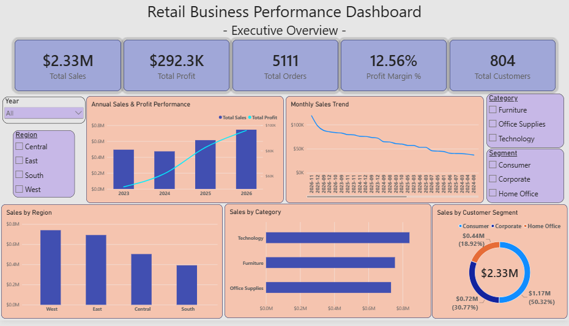
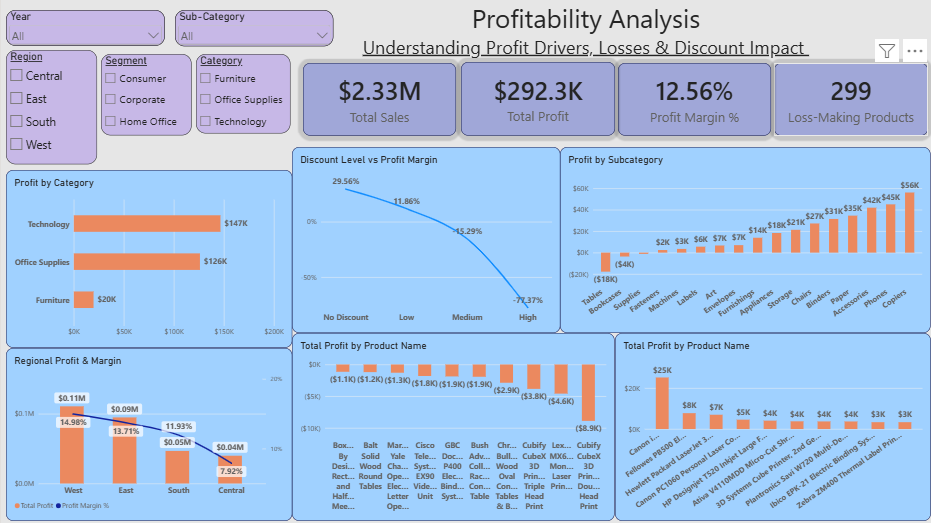
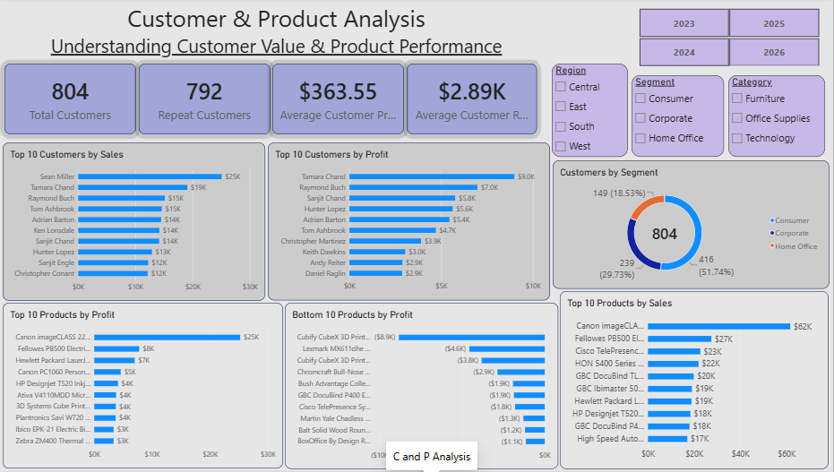

# Retail Business Performance Analysis

**End-to-End Business Analyst Portfolio Project using MySQL & Power BI**

## 📌 Project Overview

This project analyzes retail business performance across **sales, profitability, customers, products, regions, customer segments, and discount levels** for the period **2023–2026**.

The project follows an end-to-end Business Analyst workflow:

**Business Questions → SQL Analysis → KPI Validation → Power BI Dashboard → Business Insights → Recommendations**

The objective is to identify key business performance drivers, profitability risks, and opportunities for improvement using data-driven analysis.

---

## 🎯 Business Objective

The analysis was conducted to answer the following business questions:

* How are sales and profit changing over time?
* Which regions generate the highest sales and profitability?
* Which customer segments contribute the most revenue and profit?
* Which categories and sub-categories are most profitable?
* Which products generate significant losses?
* Which customers contribute the most revenue and profit?
* How are discount levels associated with profitability?
* Where should management focus improvement efforts?

---

## 📊 Dataset

The dataset contains **10,194 transaction records** across **21 attributes**, covering orders, customers, products, regions, segments, sales, quantity, discount, and profit.

### Analysis Period

**2023 – 2026**

### Key Fields

* Order ID
* Order Date
* Ship Date
* Ship Mode
* Customer ID
* Customer Name
* Segment
* Country/Region
* City
* State/Province
* Postal Code
* Region
* Product ID
* Category
* Sub-Category
* Product Name
* Sales
* Quantity
* Discount
* Profit

---

## 🛠️ Tools & Technologies

* **MySQL** — Data exploration, SQL analysis, KPI calculations, advanced queries, ranking, and validation
* **Power BI** — Interactive dashboard, DAX measures, data modeling, and visualization
* **Excel** — Data inspection and supporting analysis
* **GitHub** — Project documentation and version control

---

## 📈 Key Business KPIs

| KPI                  |       Result |
| -------------------- | -----------: |
| Total Sales          |   **$2.33M** |
| Total Profit         | **$292.30K** |
| Profit Margin        |   **12.56%** |
| Total Orders         |    **5,111** |
| Total Customers      |      **804** |
| Total Quantity       |   **38,654** |
| Average Order Value  |  **$455.20** |
| Repeat Customers     |      **792** |
| Loss-Making Products |      **299** |

---

# 📊 Power BI Dashboard

The Power BI dashboard consists of three analytical pages designed around management-focused business questions.

## 1. Executive Overview

Provides a high-level view of:

* Overall sales and profitability
* Annual performance
* Monthly sales trends
* Regional sales
* Category performance
* Customer segment performance



---

## 2. Profitability Analysis

Focuses on:

* Category profitability
* Sub-category profitability
* Regional profit and margins
* Discount levels and profitability
* Top profitable products
* Bottom-performing products



---

## 3. Customer & Product Analysis

Focuses on:

* Customer value
* Repeat customers
* Top customers by sales
* Top customers by profit
* Customer segment distribution
* Top products by sales
* Top products by profit
* Bottom products by profit



---

## 📁 Power BI File

The complete Power BI project file is available here:

**`PowerBi/Retail_Business_Performance_Analysis.pbix`**


The `.pbix` file contains the Power BI data model, relationships, DAX measures, slicers, and dashboard visuals.

---

# 🔍 SQL Analysis

MySQL was used to perform the core analytical work and validate the KPIs used in the Power BI dashboard.

### SQL Analysis Areas

### 1. Data Exploration

* Dataset structure and record counts
* Date range validation
* Unique customers, orders, and products
* Overall business KPIs
* Data quality checks

### 2. Sales Analysis

* Yearly sales performance
* Year-over-year growth
* Monthly sales trends
* Regional sales
* Customer segment performance
* Category performance

### 3. Profitability Analysis

* Category and sub-category profitability
* Profit margin analysis
* Regional profitability
* Discount analysis
* Discount band analysis
* Loss-making products
* High-sales / low-profit products

### 4. Customer Analysis

* Top customers by revenue
* Top customers by profit
* Orders per customer
* Repeat vs one-time customers
* Customer value segmentation
* Loss-making customers
* Customer rankings

### 5. Product Analysis

* Top products by sales
* Top products by quantity
* Top products by profit
* Bottom products by profit
* Product profitability classification
* Category and sub-category analysis
* Product ranking using window functions

---

# 💡 Key Business Insights

### 1. Strong Recent Sales Growth

Sales declined by **4.26% in 2024**, followed by strong growth of **29.80% in 2025** and **21.44% in 2026**.

### 2. West Leads Regional Performance

The West region generated approximately **$739.8K in sales** and achieved the highest regional profit margin of **14.98%**.

### 3. Furniture Has a Profitability Concern

Furniture generated approximately **$754.7K in sales**, but only **$19.7K in profit**, resulting in a low **2.61% profit margin**.

### 4. Tables Are the Largest Loss-Making Sub-Category

Tables generated approximately **-$17.75K in profit** and accounted for around **78.7% of the total losses among loss-making sub-categories**.

### 5. Higher Discounts Are Associated With Weaker Profitability

Profit margin declined substantially across discount levels, from **29.56% for transactions with no discount** to **-77.37% for the high-discount band**.

### 6. High Revenue Does Not Always Mean High Profitability

Several high-revenue customers and products generated negative profit, demonstrating the importance of evaluating both revenue and profitability.

### 7. Technology Is a Major Profit Driver

Technology generated approximately **$146.5K in profit** with a **17.45% profit margin**.

### 8. Multiple Products Require Profitability Review

The analysis identified **299 products with negative profit**, creating opportunities for product-level pricing, cost, and discount review.

---

# 💼 Business Recommendations

### 1. Review Furniture Profitability

Investigate pricing, costs, and discounting within the Furniture category, particularly for loss-making sub-categories such as Tables and Bookcases.

### 2. Strengthen Discount Management

Review high-discount transactions and establish appropriate discount controls to reduce margin erosion.

### 3. Review Loss-Making Products

Prioritize products with high sales but negative profit and investigate their pricing, costs, and discount levels.

### 4. Investigate Central Region Performance

Analyze Central region performance by category, sub-category, customer segment, and discount level to identify the drivers behind its relatively low **7.92% margin**.

### 5. Evaluate Customer Value Using Profitability

Assess customers using a combination of **revenue, profit, and order frequency** instead of relying on revenue alone.

### 6. Protect High-Margin Categories

Identify successful products within Technology and Office Supplies and explore opportunities for profitable growth.

---

# 📂 Project Structure

```text
Retail-Business-Performance-Analysis/
│
├── README.md
│
├── Data/
│   └── Superstore.csv
│
├── SQL/
│   ├── 01_Data_Exploration.sql
│   ├── 02_Sales_Analysis.sql
│   ├── 03_Profitability_Analysis.sql
│   ├── 04_Customer_Analysis.sql
│   └── 05_Product_Analysis.sql
│
├── PowerBi/
│   └── Retail_Business_Performance_Analysis.pbix
│
├── Dashboard/
│   ├── Executive_Overview.png
│   ├── Profitability_Analysis.png
│   └── Customer_and_Product_Analysis.png
│
└── Reports/
    └── Business_Analysis_Report.docx
```

---

# 📄 Business Analysis Report

A detailed business analysis report is included in the `Reports` folder.

The report covers:

* Executive Summary
* Business Objective
* Dataset & Methodology
* Overall Business Performance
* Sales Performance
* Profitability Analysis
* Customer Analysis
* Product Analysis
* Key Business Findings
* Business Recommendations
* Conclusion

**Report:** `Reports/Business_Analysis_Report.docx`

---

# 🧠 Analytical Approach

The project was approached from a Business Analyst perspective rather than focusing only on descriptive statistics.

The workflow was:

```text
Business Problem
       ↓
Business Questions
       ↓
Data Exploration
       ↓
SQL Analysis
       ↓
KPI Validation
       ↓
Power BI Visualization
       ↓
Business Insights
       ↓
Recommendations
```

This approach helped translate raw transactional data into actionable business findings.

---

# 📌 Conclusion

This project demonstrates an end-to-end Business Analytics workflow using **MySQL and Power BI**.

The analysis identified strong recent sales growth while highlighting important profitability challenges across Furniture, certain sub-categories, products, regions, and high-discount transactions.

The resulting Power BI dashboard provides an interactive view of business performance, while the SQL analysis and business report demonstrate the process of moving from raw data to insights and actionable recommendations.

---

## 👤 Author

**Abdul Shakir R**

**Aspiring Business Analyst**

Skills demonstrated in this project:

**SQL | Power BI | DAX | Data Analysis | Data Visualization | Business Analysis | Business Insights**
